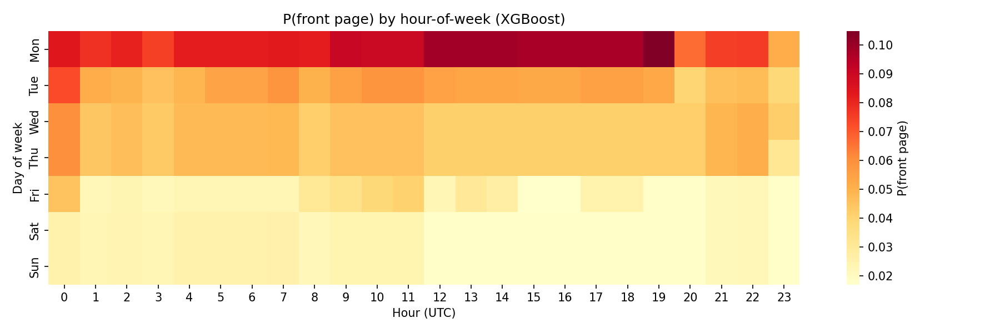

# HackerAdvertising

HN optimal posting time & advertising value model. Implements the research spec in `hn_agent_prompt.md`.

## Advertising value of Hacker News

Hacker News front-page placement delivers large, measurable traffic. Case studies and self-reports put top positions in the tens of thousands of unique visitors per day; the audience skews toward developers, founders, and technical decision-makers. In advertising terms, that reach has high CPM-equivalent value because the audience is hard to reach through standard display inventory. This project estimates that value (advertising equivalent value, AEV) and models when submissions are most likely to reach the front page, so that expected value can be stated in dollar terms.

## Method

**Phase 1 — Timing:** We use 12 months of story data from the Algolia HN API, replicate prior timing studies (Schaefer, chanind, Myriade), and fit an XGBoost model for P(front page) given hour-of-week, competition load, and post type. We treat two objectives separately: maximizing P(front page) (low competition) and maximizing reach (peak traffic). Results are reported for both.

**Phase 2 — AEV:** We estimate advertising equivalent value from published traffic priors, CPM benchmarks for developer/B2B audiences, and corrections for ad-blocker undercount and aggregator long-tail. An influence multiplier accounts for downstream spread (readers sharing with peers). The main output is expected AEV per submission: P(front page) × typical AEV when on front page.

## Setup

```bash
python3 -m venv .venv && source .venv/bin/activate
pip install -r requirements.txt
```

## Usage

```bash
# Fetch 12 months of HN data from Algolia
python fetch_data.py

# Phase 1: Timing analysis (replication, models, heatmap)
python run_phase1.py

# Phase 2: AEV model and sensitivity
python run_phase2.py

# Full pipeline
python run_all.py
```

## Outputs

- `data/algolia_stories.parquet` — historical story data
- `reports/timing_heatmap.png` — P(front page) by hour-of-week
- Console: prior studies table, feature importance, AEV sensitivity table

## Results

*Based on 52,000 stories from Algolia (12 months).*

### Prior Studies Replication

Prior work used different dependent variables (top-post timing vs. P(front page) vs. Show HN–specific). We replicate each methodology on current data to see if conclusions hold or have shifted as HN has grown.

| Study | Their Conclusion | Replicated on Current Data |
|-------|------------------|----------------------------|
| Schaefer/Medium 2017 | Mon/Wed 5–6 PM UTC | Tue 17:00 UTC |
| chanind.github.io 2019 | Sun 6am UTC 2.5× better | Sun 20:00 UTC |
| Myriade 2025 | 12:00 UTC weekends | Tue 15:00 UTC |

### Timing Model (XGBoost)



Post type dominates timing: Show HN and URL posts get a ranking boost; Ask HN gets a penalty. Among timing features, `hour_of_week` and `competition_load` matter most — posting when fewer others submit improves odds. The heatmap shows P(front page) by UTC hour and day; darker = higher probability.

**Feature importance:** `is_show_hn` (40%), `has_url` (25%), `hour_of_week` (8%), `competition_load` (8%), `hour_of_day` (7%), `title_word_count` (6%), `is_ask_hn` (6%).

**Recommendations:**
- **Maximize P(front page):** Mon 19:00 UTC
- **Maximize reach:** Post during peak traffic (US daytime UTC 14–22)

### Advertising Equivalent Value (AEV)

Traffic estimates come from published case studies; we apply a 1.4× ad-blocker correction (HN audience blocks more than average). CPM is calibrated to developer/B2B benchmarks: $100 for dev tools, $65 for general tech, $40 for adjacent. The "w/ Influence" column adds downstream reach (each visitor influences ~3 peers at 30% CPM).

| Scenario | Rank | Hours | Category | Direct AEV | w/ Influence |
|----------|------|-------|----------|------------|--------------|
| Best case | #1 | 20 | dev_tools | $24,570 | $41,580 |
| Strong result | #3 | 12 | dev_tools | $11,466 | $19,404 |
| Typical result | #10 | 6 | general_tech | $1,065 | $1,802 |
| Marginal | #25 | 2 | adjacent | $66 | $111 |

**Breakeven CPC:** If a rank #5 post drives 30k visitors and developer CPC on LinkedIn is $8–15, the click-equivalent value is $240k–$450k. This bounds the impression-based AEV from above.

**Expected AEV per submission** (P(front) × typical AEV) — the synthesis metric:
- Dev tools: post Mon 19:00 UTC → ~$2,100 expected
- General tech: post Mon 19:00 UTC → ~$210 expected
